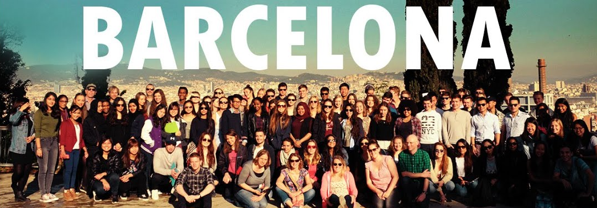
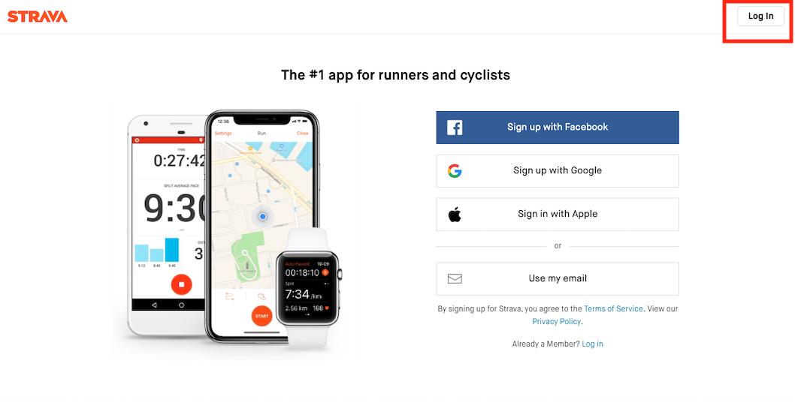
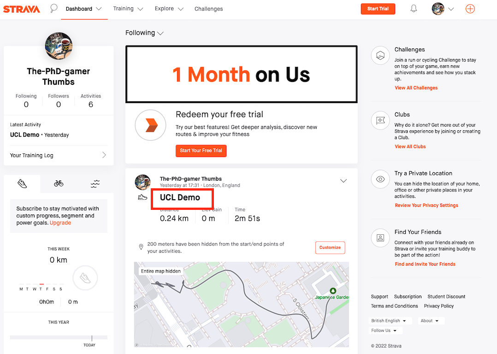
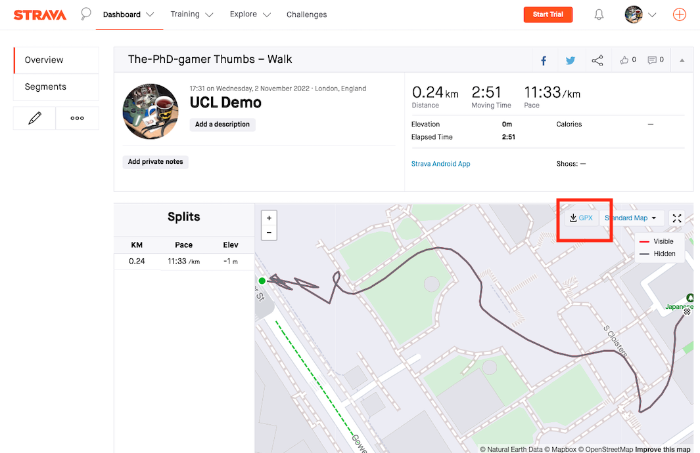

# Part 1: Data Collection for Field Trip {-}

```{r echo=FALSE, out.width = "100%", fig.align='center', cache=TRUE,}
 
```

## Preparation for the field trip {-}

Please make sure to have read carefully through the [**BCN-Urban Project Worksheet**](https://github.com/UCLPG-MSC-SGDS/GEOG0013-GIS/raw/main/Guidance_notes/BCN-Urban_projects_Worksheet_2022.pdf) as it contains the key objectives of the field activity. For the Barcelona (and London) Urban Project, you will need to bring your **worksheet**, **field notebook (i.e., diary)** and **smartphone**. Note that the section here contains some guidance notes for fulfilling some of the objectives relating to the plotting of routes and recording of geo-tags with smartphones.

Here are some following points to do before departing:

1. Install **Strava** onto at least one group member’s smartphone – this is for route data collection.
2. Install **Google Earth** onto at least one group member’s smartphone - this is for recording coordinates for the point observations you want to record in accordance to the selected theme (e.g. street vendor locations, graffiti, Catalan flags, cyclists, and other locations that pique your interest).
3. Try the apps out for yourself for familiarity.

<div class="note">
**IMPORTANT NOTE:** You will need the two apps to collect your human geography digital data in Barcelona and London. Please make note that the collection of data is a team effort. The more people in the group who install these apps, as well as being engaged with data collection, the better, and the less chance there is of something going wrong in the field.
</div>

## Training materials for Google Earth & Strava app {-}

The table below contains all the information needed to get you started with using the smartphone apps.

|**Guidance**|**Google Earth App**|**Strava App**|
|:------------------------------------------------------------------------- |:------------------------------ |:------------------------------   |
|**[1] How to install apps on smartphone**| [**Notes**](https://github.com/UCLPG-MSC-SGDS/GEOG0013-GIS/raw/main/Guidance_notes/How%20to%20install%20Google%20Earth%20App.pdf), [**Video**](https://web.microsoftstream.com/video/a3fe1790-15b2-450d-8e2f-0b6656aafd6c) | [**Notes**](https://github.com/UCLPG-MSC-SGDS/GEOG0013-GIS/raw/main/Guidance_notes/How%20to%20install%20Strava%20App.pdf), [**Video**](https://web.microsoftstream.com/video/a2822f80-c53c-4a10-b1d5-7622ac954373) |
|**[2] How to collect point or route data**| [**Notes**](https://github.com/UCLPG-MSC-SGDS/GEOG0013-GIS/raw/main/Guidance_notes/How%20to%20collect%20observations%20with%20Google%20Earth%20App.pdf), [**Video**](https://web.microsoftstream.com/video/8bb58f97-b403-485b-805d-4e94a068627e) | [**Notes**](https://github.com/UCLPG-MSC-SGDS/GEOG0013-GIS/raw/main/Guidance_notes/How%20to%20collect%20route%20data%20with%20Strava%20App.pdf), [**Video**](https://web.microsoftstream.com/video/babcefc2-2bc3-4ac5-a3a3-4444b5f8a841) |

<div class="note">
**TIP**: When geo-tagging points of interest, and taking associated notes in diaries, pictures, videos, or audio footage. There has to be a link between the points and collected dataset so you know what information corresponds to each other. We recommend that you apply some reference number for the location with coordinates you geo-tagged (e.g., "site 1" or "S1" and the next will be "site 2" or "S2" etc.,) and then annotate you notes, pictures, videos or audio footage with the same reference number so you know which data corresponds with each other. 

You can do this with you phones through screenshooting and applying text to it. Here is a crude example (see image below):

**Revisiting the location in London where the 1854 Cholera epidemic was pronounced**

```{r echo=FALSE, out.width = "100%", fig.align='center', cache=TRUE,}
knitr::include_graphics('images/general/Preparation/10_Linkage.png') 
```
</div>

## What to do next with the collected data? {-}

### [1] Downloading your route data {-}

Once you have finished using Strava, and saving the routes. Downloading your route data from Strava is simple. Here are the steps:

1. Go to [**https://www.strava.com**](https://www.strava.com) and log into your user account (i.e., the one you created earlier on when you installed the app)

```{r echo=FALSE, out.width = "100%", fig.align='center', cache=TRUE,}
 
```

2. You will log in and see your dashboard. Select your route shown in the home feed.

```{r echo=FALSE, out.width = "100%", fig.align='center', cache=TRUE,}
 
```

3. You should be able to download you route data by clicking on the "**GPX**" highlighted in the image below. We will use this data for the workshop. 
```{r echo=FALSE, out.width = "100%", fig.align='center', cache=TRUE,}
 
```

### [2] Compiling you geo-tagged data into a spreadsheet {-}

You should compile your geo-tagged data into a spreadsheet and save it as comma separated value format (.csv). You are highly encouraged you collaborate to do this chore as a group:

Here are the steps:

1.	Create a new spreadsheet in Excel. Create three columns marked `**siteID**’, ‘**latitude**’ and ‘**longitude**’. 
2.	Input details of the points of interest you recorded in Barcelona into the spreadsheet. To do this you will need to look at your field diary and also any screenshots you took. Make sure that the lat/long coordinates for each site are accurately recorded. Any qualitative information about each site you recorded (e.g. its type, other observations) can also be recorded in a fourth column if you want.
3.	Your dataset should end up looking like the screenshot below. Remember that we expect each group to have at least 30 site observations. Save your work as a .csv file.

```{r echo=FALSE, out.width = "100%", fig.align='center', cache=TRUE,}
knitr::include_graphics('images/general/preparation/5_Spreadsheet.png') 
```

<div class="note">
**WARNING:** When recording your coordinates to a spreadsheet, be mindful of whether a latitude is north (N) or south (S), or a longitude is east (E) or (W). The latitudes for London and Barcelona all fall above the equator (N) and so they should always be a positive value. However, London and Barcelona are very close to the Prime Meridian, and so their longitudes can potentially fall either above (E) or below (W) the Prime Meridian. If the longitude is below the Prime Meridian (W) then add a minus sign to that value.    
</div>

<div class="note">
**IMPORTANT NOTE:** You can compile the data in the comfort of your hotel or when you are back in London. Just make you don't lose all your hard work!  
</div>

### [3] Uploading your shared data to Moodle {-}

On the course Moodle page, a forum will be opened for members of each group to upload:

1. The Strava route data (as a .gpx file)
2. The .csv file containing all site observations and their coordinates. Uploading this data to Moodle will ensure everyone from the group can get access to it during and after the practical class.

When posting to Moodle, please give your file names informative titles that close team members can recognise the files (for instance Group1_route.gpx etc.). Please this no later than **11:59pm on Tuesday, November 21st 2022** on the week we are having our GIS Workshop. Remember that if the two files are not uploaded to Moodle before the practical class it will not be possible for everyone in the group to complete their work.

Videos, notes and photos should be shared among team members via Whatsapp groups.

