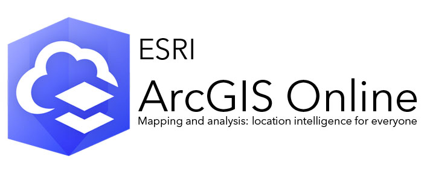

# Part 2: GIS Workshop {-}

```{r echo=FALSE, out.width = "100%", fig.align='center', cache=TRUE,}
 
```

Welcome to **GIF1’s Introduction to GIS & Mapping**. This session focuses on the themes of **GIS (Geographical Information Systems)** and **Digital Geography**. Here, we will provide you with an introduction on how to visualise geographic data collected from the field trip in Barcelona and London using the online platforms: **ArcGIS Map**, and **ArcGIS StoryMaps** for interactive mapping and digital storytelling.

We prepared some tutorials to help you create your own interactive StoryMap but we will be using the steps from a motivating example used to create the story map titled: **"Short Revisit to the Cholera Outbreak in Soho, London (1854)"** 

[**[SEE EXAMPLE HERE]**](https://arcg.is/5SaXT)

## Timetable & Group Allocation {-}

This is a 3-hour group computer practical workshop that will be delivered in-person. All students have been allocated to one of 7 groups (i.e., group **A**, **B**, **C**, **D**, **E**, **F** or **G**). The workshop for week 6's **Introduction to GIS** will take place on the following dates:

1. **Wednesday 15th November, 09:00am-12:00pm** for groups **A**, **B** and **C**
2. **Friday 17th November, 02:00pm-05:00pm** for groups **D**, **E**, **F** and **G**

**Group room allocations**: Here are the details for the room location. Please use the table below to view the map details of the location, as well as watch the embedded videos to see how to get to the location. To avoid confusion, please go to your group's designated cluster room.

|**Group**|**Date**|**Location**|
|:--- |:---------        |:-----------------------   |
|**A**|**Wednesday, 15/11**|IOE, Bedford Way (20) Room 425 (PC Lab 2), [**Map**](https://www.google.com/maps/dir/UCL+Main+Campus,+Gower+Street,+London/51.5230556,-0.1281389/@51.5238501,-0.1328513,399m/data=!3m1!1e3!4m9!4m8!1m5!1m1!1s0x48761b2f42906f4d:0xe2bdd108bab11257!2m2!1d-0.1344218!2d51.5244928!1m0!3e2?entry=ttu)|
|**B**|**Wednesday, 15/11**| IOE, Bedford Way (20) Room 429 (PC Lab 1), [**Map**](https://www.google.com/maps/dir/UCL+Main+Campus,+Gower+Street,+London/51.5230556,-0.1281389/@51.5238501,-0.1328513,399m/data=!3m1!1e3!4m9!4m8!1m5!1m1!1s0x48761b2f42906f4d:0xe2bdd108bab11257!2m2!1d-0.1344218!2d51.5244928!1m0!3e2?entry=ttu)|
|**C**|**Wednesday, 15/11**|Torrington Place (1-19) B07 Teal Room, [**Map**](https://www.google.com/maps/dir/UCL+Main+Campus,+Gower+Street,+London/51.521906,-0.134348/@51.5230001,-0.1354731,352m/data=!3m1!1e3!4m9!4m8!1m5!1m1!1s0x48761b2f42906f4d:0xe2bdd108bab11257!2m2!1d-0.1344218!2d51.5244928!1m0!3e2?entry=ttu) |
|**D**|**Friday, 17/11**|Bedford Way (26) Room 316 Public Cluster, [**Map**](https://www.google.com/maps/dir/UCL+Main+Campus,+Gower+Street,+London/51.52392,-0.128788/@51.5240663,-0.1325471,403m/data=!3m1!1e3!4m9!4m8!1m5!1m1!1s0x48761b2f42906f4d:0xe2bdd108bab11257!2m2!1d-0.1344218!2d51.5244928!1m0!3e2?entry=ttu)|
|**E**|**Friday, 17/11**| IOE, Bedford Way (20) Room 425 (PC Lab 2), [**Map**](https://www.google.com/maps/dir/UCL+Main+Campus,+Gower+Street,+London/51.5230556,-0.1281389/@51.5238501,-0.1328513,399m/data=!3m1!1e3!4m9!4m8!1m5!1m1!1s0x48761b2f42906f4d:0xe2bdd108bab11257!2m2!1d-0.1344218!2d51.5244928!1m0!3e2?entry=ttu)|
|**F**|**Friday, 17/11**|UCL School of Pharmacy Room B37, [**Map**](https://www.google.com/maps/dir/UCL+Main+Campus,+Gower+Street,+London/51.525038,-0.122356/@51.5237371,-0.1303958,16.77z/data=!4m9!4m8!1m5!1m1!1s0x48761b2f42906f4d:0xe2bdd108bab11257!2m2!1d-0.1344218!2d51.5244928!1m0!3e2?entry=ttu)|
|**G**|**Friday, 17/11**|IOE, Bedford Way (20) Room W3.05, [**Map**](https://www.google.com/maps/dir/UCL+Main+Campus,+Gower+Street,+London/51.5230556,-0.1281389/@51.5238501,-0.1328513,399m/data=!3m1!1e3!4m9!4m8!1m5!1m1!1s0x48761b2f42906f4d:0xe2bdd108bab11257!2m2!1d-0.1344218!2d51.5244928!1m0!3e2?entry=ttu)|

<div class="note">
**IMPORTANT NOTE**: The locations are public clusters with PC workstations. However, I highly recommend you bring your own laptop for computer practicals as it will make data transfer (and life) incredibly easy.  
</div>

## Self-guided tutorials {-}

You have been given early access to the content. You are welcome to go through the self-guided tutorials presented on this website at your own pace before the workshop. The teaching materials have been designed to be accessible to anyone who has never used the online platforms: **ArcGIS Maps** or **ArcGIS Storymaps**. The tutorials are very prescriptive with instructions, and these instructions are supported with guided videos.

The workshop is split into **two** main sections: 

1. Creating an interactive map using the **ArcGIS Map** application
2. Creating a StoryMap integrated with the interactive map in **ArcGIS StoryMap** application

The whole point of these tutorials are to provide you with guidance on how you can make you own interactive maps and StoryMap application with you own data collected from Barcelona, or London. 

<div class="note">
**IMPORTANT NOTE**: You must create a StoryMap with the lore elements of your theme and the interactive map embedded to it, which must be submitted as a link using the submission sheet. This assignment is worth 10.0% of the assessment, and the deadline is on **Friday, 8th December before 12:00pm** 
</div>

## Questions & Discusson Forum on Moodle {-}

On **Moodle** you can use the **Forum: Questions and Discussion** platform to post general questions about the content on this webpage, or for posting problems on technical issues you have encountered during your self-guided study. Myself, or one of the PGTA will respond accordingly with solutions. Students are welcome to engage and support each other in-person and/or through this forum during this self-study time.  