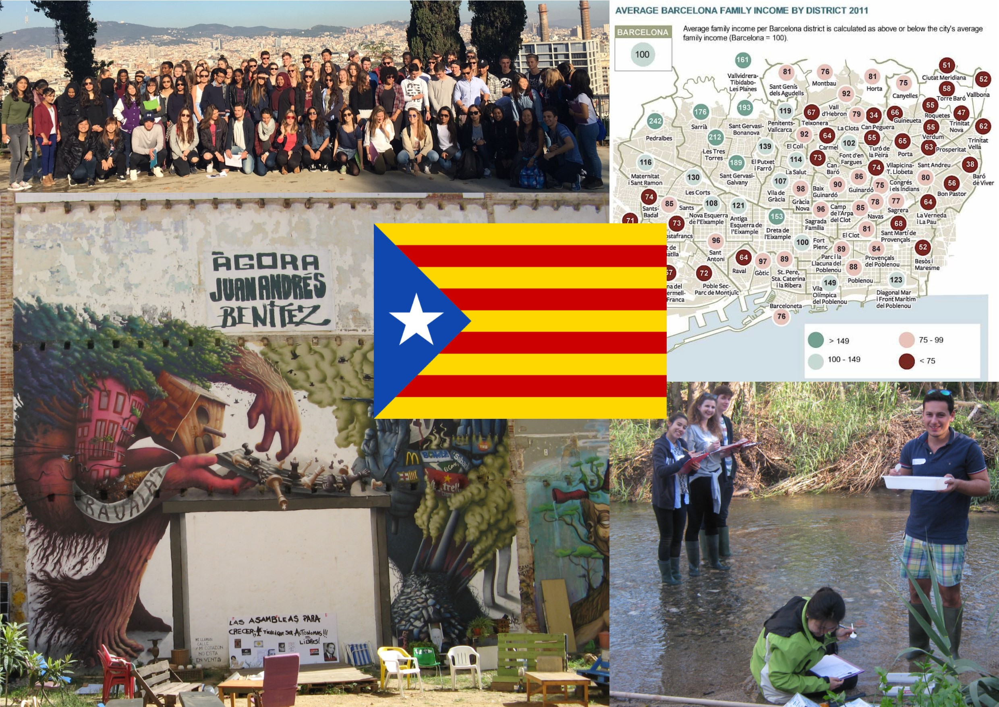

# Welcome to Introduction to GIS {.unnumbered}

```{r echo=FALSE, out.width = "100%", fig.align='center', cache=TRUE,}
 
```

Welcome to **GIF1's** **Introduction to GIS**. This resource focuses on the themes of **data collection**, **fieldwork** and **GIS** for story mapping and digital human geography. Here, we will provide you with the necessary information and training to prepare you for collecting you data needed to accomplish the tasks for the **Urban Project** and workshop 2's **Introduction to GIS**. 

## Structure {-}

This resource is split into **two** parts:

- **Part 1** of this resource contains the necessary self-guided training materials (i.e., guidance notes and demonstration videos) for using the smartphone applications such as **Google Earth APP** and **Strava** for collecting the your data in the field in London and Barcelona.
- **Part 2** contains the information needed to developing your own **Story Maps** using an online platform called **ArcGIS Online**. You will need the data collected from the activities in London and Barcelona field trips to complete the exercise and benefit from the Workshop which will be hosted on **Wednesday 23rd November**, and **Friday 25th November**. The learning content for **Part 2** will be released a week ahead of these dates.

## Contact Details {-}

Feel free to contact me via email for help, you can also book appointments for additional support if need be. My office is based at UCL Department of Geography, North West Wing building [[**Map**]]((http://www.ucl.ac.uk/maps/north-west-wing-building)). 

**My contact information are:**

Anwar Musah | Lecturer in Social & Geographic Data Science </br>
UCL Department of Geography </br>
University College London </br>
Room 115 North-West Wing, Gower Street, London, WC1E 6BT </br>
Email: a.musah@ucl.ac.uk
